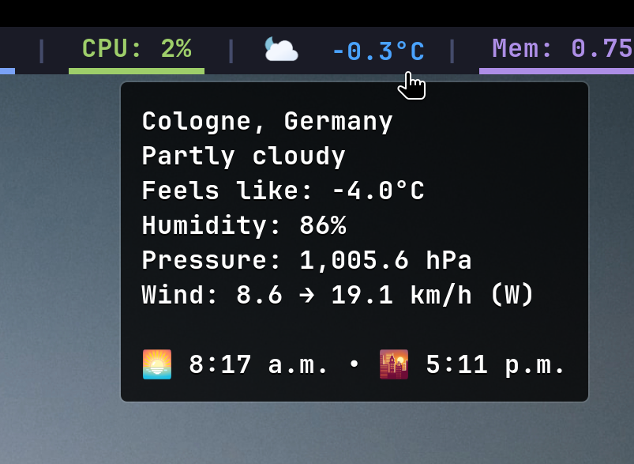
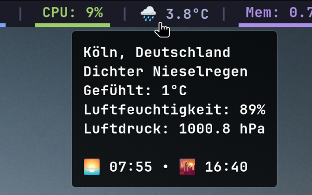

<!--
SPDX-FileCopyrightText: Winni Neessen <wn@neessen.dev>

SPDX-License-Identifier: MIT
-->

# waybar-weather
### A simple and elegant Waybar module to display weather data from Open-Meteo.

## About
waybar-weather is a simple programm written in Go that fetches weather data from Open-Meteo
and presents it in a format suitable to be used as custom Waybar module. It uses different
geolocation providers to determine your current location and fetches weather data for that 
location. The geolocation is continuously monitored and updated if the location changes, 
allowing you to always see the weather data for your current location.

## Features
* [Uses different geolocation providers to find your current location](#geolocation-lookup)
* [Supports different geocoding providers for the reverse location lookup via coordinates](#geocoding-provider)
* [Supports different weather providers](#weather-providers)
* Integrates with [Waybar](https://github.com/Alexays/Waybar) as a custom module
* [Supports the waybar stying system providing custom CSS classes](#styling)
* Display conditions, temperature and moon phase for your current location
* [Fully customizable via its integrated template engine](#templating)
* [Support for multiple languages](#internationalization--localization)
* [Configurable via TOML, JSON or YAML](#configuration)
* Lightweight single binary written in Go
* Runs a service in the background to automatically update the weather data and does not require constant
  re-execution (like with comparable waybar weather modules).
* [Sleep/resume detection](#sleepsuspend-and-resume-detection)
* [Support for waybar CSS-based styling](#styling)

## Requirements
* A working Linux installation with Waybar running.
* Network connectivity for API calls.
* (Optional) For the ICHNAEA geolocation service, an active WiFi connectivity is required ofr more precise location
  lookup.
* (Optional) For even better location lookup, you can use a GPS device connected to your computer. This requires gpsd to
  be installed and running.

## Screenshots
 &nbsp;


## Installation

### Linux distribution package manager
waybar-weather can be found on the following linux distributions:
- Arch Linux AUR: [https://aur.archlinux.org/packages/waybar-weather](https://aur.archlinux.org/packages/waybar-weather)

### Using Pre-Built Binary
Pre-Built binaries are automatically built whenever a new release is created. Each release
holds binaries for several different Linux distributions. A checksum of each file is created
and stored in a combined checksums file. This checksums file is digitally signed via GPG. 
After downloading the corresponding file, make sure to also download the checksums file and its
corresponding signature file and verify that the checksums and signatures match.
The public GPG key is: ["Winni Neessen" (Software signing key) <wn@neessen.dev>](https://keys.openpgp.org/vks/v1/by-fingerprint/10B5700F5ECCB06532CEC873C3D38948DA536E89)

### From Source
To build from source, you require a working Go environment. Go 1.25+ is required.
Run the following commands to build the binary:
```bash
git clone https://github.com/wneessen/waybar-weather.git
cd waybar-weather
go mod tidy
go mod download
go mod verify
go build -o waybar-weather ./cmd/waybar-weather
```

## Configuration

### waybar-weather configuration
waybar-weather comes with defaults that should work out of the box for most users. 
You can however override these defaults by providing a configuration file. By default
waybar-weather will look for a configuration file in the user's home config directory 
at `~/.config/waybar-weather/`. If that directory holds a config file (`config.<ext>`) 
in either TOML, JSON or YAML format, waybar-weather will use it. Alternatively, you can 
provide a path to a configuration file via the `-config` flag. A example configuration 
file can be found in the [etc](etc) directory.

### Integration with Waybar
waybar-weather integrates effortlessly with Waybar.

Add the following to your waybar config file (usually `.config/waybar/config.jsonc`):
```json
"custom/weather": {
    "exec": "<path_to_your>/waybar-weather",
    "restart-interval": 60,
    "return-type": "json",
    "hide-empty-text": true,
    "on-click": "pkill -USR1 waybar-weather"
}
```

Once you added that, add the module to your waybar module of choice, similar to this:
```json
"modules-right": [
    "cpu",
    "custom/weather",
    "battery",
    "clock"
],
```

## Styling

waybar-weather emits a custom CSS class to waybar, so you can apply your custom style to it. The class is
always `waybar-weather`. Add the following to your waybar config file (usually `.config/waybar/style.css`) to adjust
the style:
```css
.waybar-weather {
    <your_style_rules>
}
```
For more details on waybar styling, please refer to the [Waybar documentation](https://github.com/Alexays/Waybar/wiki/Styling).

### Special CSS classes
Additionally to the `waybar-weather` class, waybar-weather emits additional CSS classes for some special 
weather conditions. These classes are:

| CSS class | Description                                                                             |
|-----------|-----------------------------------------------------------------------------------------|
| `cold`    | This class is emitted when the temperature falls below the configured `cold_threshold`. |
| `hot`     | This class is emitted when the temperature rises above the configured `hot_threshold`.  |
| `snow`    | This class is emitted when it is snowing.                                               |
| `rain`    | This class is emitted when it is raining.                                               |
| `smoke`   | This class is emitted when it is foggy or hazy.                                         |

You can use these classes to style your waybar-weather to e. g. show the temperature in red when it's hot or
blue when it's cold or to perform a transition blinking animation when it's snowing.

Here is some example CSS you can add to your waybar `style.css` file to accomplish this:

```css
.waybar-weather {
    animation-timing-function: linear;
    animation-iteration-count: infinite;
    animation-direction: alternate;
}

.waybar-weather.hot {
    color: #a91313;
}

.waybar-weather.cold {
    color: #5fa4ec;
}

.waybar-weather.rain,
.waybar-weather.snow,
.waybar-weather.smoke {
    animation-name: blink-condition;
    animation-duration: 1s;
}
```

### Custom SVG icons instead of UTF-8
Since v0.3.0 waybar-weather supports custom SVG icons for the weather condition instead of the default UTF-8
icons. This is established using the (very limited) CSS capabilities of waybar. You can enable SVG icons in your 
configuration by setting the `use_css_icon` option to `true` in the `[templates]` section.

Once enabled, waybar-weather will change the default text template (if you are using a differnt text template
than the default one, waybar-weather will not touch it. You have to adjust it accordingly yourself) to omit the 
UTF-8 icon and instead emit a CSS class for the corresponding weather condition (as WMO code). For SVG icons 
to work, you also need to update your waybar `style.css` file and include the stylesheet that is shipped in 
the [contrib/style](contrib/style) directory. Copy the `waybar-weather.css` file from the contrib directory 
into your `~/.config/waybar/` directory and add the following line to your `style.css` file:

```css
@import "waybar-weather.css";
```

Finally, you need to add a matching iconset to your waybar config directory. waybar-weather ships with a default
iconset - the "[Meteocons](https://basmilius.github.io/weather-icons/)" iconset by [Bas Milius](https://bas.dev/).
You can find the iconset in the [contrib/icons](contrib/icons) directory. Copy the `meteocons` directory into your
`~/.config/waybar/` directory as `weather-icons`:

```shell
cp -a contrib/icons/meteocons ~/.config/waybar/weather-icons
```
(When you installed waybar-weather using a package manager, these files are usually located in 
`/usr/share/waybar-weather/`.

You can replace the weather icons with your own iconset as long as the naming convention of the icons is the same.

Depending on your waybar style, you might have to adjust the `waybar-weather.css` to your liking. I've tested it
with the default Omarchy waybar style and it works fine.

Once you completed your waybar styling changes, you need to restart waybar for the changes to take effect:
```bash
killall waybar && waybar
```

## Privacy statement

waybar-weather does not collect, or store personal data on its own. However, to provide weather information and
geolocation lookup functionality, it may communicate with third-party services.

### Third-party services

Retrieving weather data requires network requests to external weather providers such as Open-Meteo. Depending on your
configuration, geocoding and reverse-geocoding requests may also be sent to external services such as Nominatim to
resolve place names or coordinates.

When making these requests, certain technical information may be transmitted to the respective service, including but
not limited to:

- Your IP address
- Request metadata (for example headers or timestamps)
- Location coordinates or place names, depending on the feature used

waybar-weather does not control how third-party services handle or retain this data. Each provider operates under its
own privacy policy and terms of service. For transparency, in our README, we provide links to the privacy policies 
or data usage statements of all supported weather, geocoding, and geolocation providers. Users are encouraged to 
review these links to understand how each service processes data and to make informed decisions about which providers 
to enable or if to use waybar-weather in their environment.

## Geolocation lookup
waybar-weather tries to automatically determine your location using its built-in geolocation lookup
service (geobus). The geobus is a simple sub-pub service that utilizes different geolocation providers
to find your location. The most accurate result will be taken for looking up the weather data. You can
disable every geobus provider in your config file. By default all providers are enabled, to provide the
best possible location lookup.

The geolocation lookup methods come with different privacy characteristics. Which providers you enable determines 
what data may leave your system and who it is shared with. We provide a brief privacy overview for each provider in
our README.

### Geolocation file
A geolocation file is a simple static file in the format `<latitude>,<logitude>` that you can place
in you local home directory at `~/.config/waybar-weather/geolocation`. If the provider is enabled and
the file is present, waybar-weather will consider the coordinates in this file as best possible result.

#### Privacy considerations
Using a static geolocation file is the most privacy-preserving option. No network requests are made to look up your
coordinates and no location data is shared with any third party (geocoding might still require third-party sharing). 
The coordinates are read locally from disk and used as-is.

### City name file
A city name file is a simple static file in the format `<city>,<country>` that you can place in your local
home directory at `~/.config/waybar-weather/cityname`. If the provider is enabled and the file is present,
waybar-weather will use the city and country from this file and perform a forward geocoding request to
resolve the corresponding geographic coordinates. For the forward geocoding request it will use the geocoding
provider configured in the `geocoding` section of the configuration file.

#### Privacy considerations
Using a city name file requires a network request to a geocoding provider to resolve the provided city and 
country into geographic coordinates. This means that location data derived from the city name, as well as 
your IP address and request metadata, may be shared with the configured geocoding provider. The city name itself 
is read locally from disk and is not shared with any third party beyond what is required to perform the 
geocoding request.

### GeoIP lookup
The GeoIP lookup provider uses [https://reallyfreegeoip.org](https://reallyfreegeoip.org) to look up
your IP and the resulting location based of that IP address. Depending on your ISP, the result might 
be very inaccurate

#### Privacy considerations
The GeoIP provider determines your location based on your public IP address by querying an external GeoIP service. This
requires sending your IP address to [https://reallyfreegeoip.org](https://reallyfreegeoip.org), which may log the 
request. reallyfreegeoip.org does not publish a privacy statement, therefore user discretion is advised.

### GeoAPI lookup
The GeoAPI lookup provider uses the [GeoAPI](https://geoapi.info/) to look up your location. It has 
shown to be more accurate than the GeoIP lookup provider but will not be as accurate as the ICHNAEA
provider.

#### Privacy considerations
The GeoAPI provider queries an external geolocation API to determine your approximate location. Similar to GeoIP, this
involves network requests to a third-party service and may expose your IP address and request metadata.
GeoAPI publishes a privacy statement in their terms at: [https://geoapi.info/terms](https://geoapi.info/terms).
GeoAPI is operated in the USA and therefore may be subject to US data privacy laws.

### ICHNAEA
The ICHNAEA location provider uses the Mozilla Location Service protocol to look up your location at
[beaconDB](https://beacondb.net/). To get your location it will look for WiFi interfaces on your computer
and scan for local networks in the area. The hardware addresses of these networks will then be transmitted
to beaconDB. The more WiFi networks waybar-weather is able to identify, the more accurate the results will
be. For most users, this will be the most accurate location source. 

#### WiFi scanning
Please note that for ICHNAEA to work, waybar-weather needs to scan for WiFi networks, which might take up to 30 
seconds for the first run. Also for the WiFi scanning to work, waybar-weather needs the `CAP_NET_ADMIN` capability. 
To enable this, you need to run the following command as sudo/root:

```shell
setcap cap_net_admin+ep /usr/bin/waybar-weather
```

#### Privacy considerations
The ICHNAEA provider uses the Mozilla Location Service protocol and relies on nearby WiFi network information to
determine your location. To do this, waybar-weather scans for local WiFi networks and transmits their hardware (MAC)
addresses as well as your IP to the beaconDB service. These addresses are used solely to estimate your location and 
do not include information about the networks you connect to.

beaconDB publishes a very open and transparent privacy statement at: [https://beacondb.net/privacy](https://beacondb.net/privacy).
The service is operated from Australia, but servers might be located in other countries due to geographic proximity.

### GPSd
The GPSd location provider uses the [GPSd](https://gpsd.gitlab.io/gpsd/index.html) daemon to look up your location. If your
computer has a GPS device connected and GPSd is running, waybar-weather will use the data provided by GPSd to
look up your location. Since GPS is generally more accurate than WiFi, this provider is usually the most accurate
location source.

#### Privacy considerations
The GPSd provider uses location data from a local GPS device via the GPSd daemon. No location data is transmitted over
the network by waybar-weather itself for the coordinate lookup. If GPSd is properly configured and does not forward 
data externally. Same as with the geolocation file provider, your coordinates might be sent to a third party during 
the geocoding process.

## Geocoding provider
waybar-weather uses geocoding providers to convert the coordinates of your location into a human readable
address. By default waybar-weather makes use of the [OpenStreetMap Nominatim](https://nominatim.openstreetmap.org/) 
API. We do support other geocoding providers though, since they might provide more accurate results, 
respond faster or provide higher focus on data privacy. The geocoding providers are configured in the 
`geocoding` section of the configuration file using the `provider` key. Please keep in mind that some providers
require an API key to function.

### OpenStreetMap Nominatim
OpenStreetMap Nominatim is the default reverse geocoding provider. It is a free and open source geocoding 
service that provides geocoding results based on OpenStreetMap data. OSM Nominatim uses sensible rate limits 
and might result in longer response times, which in turn might result delayed display of weather data.

#### Privacy considerations
When using OpenStreetMap Nominatim as the geocoding provider, waybar-weather sends geographic coordinates to the public
Nominatim API to resolve them into a human-readable address. This requires making network requests to servers operated
by the OpenStreetMap community or their hosting providers.

These requests may include your IP address and request metadata, which may be logged by the service. The OSM foundation
publishes their privacy policy at: [https://osmfoundation.org/wiki/Privacy_Policy](https://osmfoundation.org/wiki/Privacy_Policy)

### OpenCage
OpenCage is a commercial geocoding provider based in Germany. They offer a free API key that can be used 
for up to 2500 requests per day (which should be more than enough for most users). OpenCage offers a dedicated
privacy option, which will make sure that [no location data of the requests are stored in their logs.](https://blog.opencagedata.com/post/145602604628/more-privacy-with-norecord-parameter)
waybar-weather makes use of this privacy option by default. Their API is also much faster than OpenStreetMap 
Nominatim. OpenCage was nice enough to provide a free API key for the waybar-weather project, so that we can do 
proper testing and development. Thank you OpenCage for your support!

To use OpenCage with your waybar-weather installation first [obtain a free API key](https://opencagedata.com/users/sign_up), 
then change the `provider` key in the `geocoding` section of your configuration file to `opencage` and add the 
`apikey` key with your API key accordingly.

#### Privacy considerations
When using OpenCage as the geocoding provider, waybar-weather sends geographic coordinates to OpenCage’s API to obtain
address information. Requests are made over the network and may include your IP address and request metadata.

OpenCage publishes their privacy policy at: [https://opencagedata.com/gdpr](https://opencagedata.com/gdpr) and is
operated in Germany and therefore has to adhere to european data privacy laws (GDPR). Together with the "no location 
data logging" feature, which we use by default, OpenCage is currently the most privacy-preserving geocoding provider 
that waybar-weather supports.

### Geocode Earth
Geocode Earth is a commercial geocoding provider based in New York. They offer a free 14-day trial plan that can 
be used for up to 1000 requests per day (which should also be more than enough for most users). Geocode Earth offers
an extensive set of data fields that allow for very precise geocoding. They were nice enough to provide a free API 
key for the waybar-weather project, so that we can do proper testing and development. Thank you Geocode Earth for 
your support!

To use Geocode Earth with your waybar-weather installation first [start a free trial](https://app.geocode.earth/users/sign_up),
then change the `provider` key in the `geocoding` section of your configuration file to `geocode-earth` and add the
`apikey` key with your API key accordingly.

#### Privacy considerations
When using Geocode Earth as the geocoding provider, waybar-weather sends geographic coordinates to Geocode Earth’s API
to perform reverse geocoding. This involves network requests to servers operated by Geocode Earth and may expose your IP
address and request metadata to the provider.

Geocode Earth publishes their privacy policy at: [https://geocode.earth/privacy/](https://geocode.earth/privacy/) and
is operated in the USA and therefore has to adhere to US data privacy laws.

## Weather providers
With release v0.3.0 waybar-weather introduced a new weather provider architecture, that allows us to easily add
support for new weather providers. The weather providers are configured in the `weather` section of the configuration
file.

### Open-Meteo
Currently, Open-Meteo is the only weather provider that waybar-weather supports out of the box. It is a free 
and open weather API that provides weather data without the need of an API key. Open-Meteo provides a vast amount
of data points and is therefore a very good choice for most users. No specific configuration is required for 
Open-Meteo and the provider will be chosen automatically as default.

#### Privacy considerations
When using Open-Meteo as the weather provider, waybar-weather sends geographic coordinates to the Open-Meteo API
to retrieve weather data. Requests are made over the network and may include your IP address and request metadata.

Open-Meteo publishes their privacy policy at: [https://open-meteo.com/en/terms#privacy](https://open-meteo.com/en/terms#privacy). 
According to their statement, Open-Meteo only collects limited non-personal technical data for operational purposes 
and does not share request data with third parties.

## Sleep/suspend and resume detection
waybar-weather will automatically detect when your computer goes to sleep and resumes from sleep
by subscribing to the D-Bus of your linux system. If your computer wakes up from sleep, 
waybar-weather will then update the weather data accordingly.

## Templating
waybar-weather comes with a templating engine that allows you to customize the output of the module.
The templating engine is based on [Go's text/template system](https://pkg.go.dev/text/template). You can
set your own template in the configuration file in the `templates` section. There is a setting for 
`text`, `alt_text`, `tooltip` and `alt_tooltip`. The `text` setting is used to display the weather data in the module. 
The `alt_text` and `alt_tooltip` setting are used to display alternate weather data when the module 
is clicked. Both tooltips setting are used to display the weather data in the tooltip when hovering over the module.

### Variables
The following variables are available for use in the templates:

#### Main data struct
| Variable             | Type              | Description                                                                   |
|----------------------|-------------------|-------------------------------------------------------------------------------|
| `{{.Latitude}}`      | `float64`         | The latitude of your current location.                                        |
| `{{.Longitude}}`     | `float64`         | The longitude of your current location.                                       |
| `{{.Address}}`       | `Address data`    | See [Address data](#address-data).                                            |
| `{{.UpdateTime}}`    | `time.Time`       | The last time the weather data was updated.                                   |
| `{{.SunsetTime}}`    | `time.Time`       | The time of sunset.                                                           |
| `{{.SunriseTime}}`   | `time.Time`       | The time of sunrise.                                                          |
| `{{.Moonphase}}`     | `string`          | The current moon phase.                                                       |
| `{{.MoonphaseIcon}}` | `string`          | The current moon phase icon.                                                  |
| `{{.Current}}`       | `Weather instant` | The [weather instant](#weather-instant) for the current weather conditions    |
| `{{.Forecast}}`      | `Weather instant` | The [weather instant](#weather-instant) for the forecasted weather condition. |

#### Address data
The address data struct holds all the address information of your current location. Please note that
not every field might be available depending on the geocoding provider and the location you are in.

| Variable                    | Type     | Description                                         |
|-----------------------------|----------|-----------------------------------------------------|
| `{{.Address.DisplayName}}`  | `string` | The the full display name of your current location. |
| `{{.Address.County}}`       | `string` | The county name of your current location.           |
| `{{.Address.State}}`        | `string` | The state name of your current location.            |
| `{{.Address.Municipality}}` | `string` | The municipality name of your current location.     |
| `{{.Address.City}}`         | `string` | The city name of your current location.             |
| `{{.Address.CityDistrict}}` | `string` | The city district of your current location.         |
| `{{.Address.Suburb}}`       | `string` | The suburb name of your current location.           |
| `{{.Address.Street}}`       | `string` | The street name of your current location.           |
| `{{.Address.HouseNumber}}`  | `string` | The house number of your current location.          |
| `{{.Address.Postcode}}`     | `string` | The postcode of your current location.              |

#### Weather instant
A weather instant holds all the weather data for a specific time. The "Current" instant always holds the current
weather conditions, while the "Forecast" instant holds the forecasted weather conditions (based on the configured
forecast hours setting). Each instant has the following fields. Please note that not every field might be available
depending on the weather provider you are using.

| Variable                             | Type        | Description                                                                    |
|--------------------------------------|-------------|--------------------------------------------------------------------------------|
| `{{.<Instant>.InstantTime}}`         | `time.Time` | The weather data timestamp for the instant's weather data.                     |
| `{{.<Instant>.Temperature}}`         | `float64`   | The current/forecasted temperature of the weather instant.                     |
| `{{.<Instant>.ApparentTemperature}}` | `float64`   | The current/forecasted apparent temperature of the weather instant.            |
| `{{.<Instant>.WeatherCode}}`         | `int`       | The WMO weather code of the weather instant.                                   |
| `{{.<Instant>.WindSpeed}}`           | `float64`   | The wind speed of the weather instant.                                         |
| `{{.<Instant>.WindGusts}}`           | `float64`   | The wind gusts speed of the weather instant.                                   |
| `{{.<Instant>.WindDirection}}`       | `float64`   | The direction in degrees of the weather instant.                               |
| `{{.<Instant>.RelativeHumidity}}`    | `float64`   | The relative humidity of the weather instant.                                  |
| `{{.<Instant>.PressureMSL}}`         | `float64`   | The pressure at mean sea level of the weather instant.                         |
| `{{.<Instant>.IsDay}}`               | `bool`      | Is set to true if it is daytime at the time of the weather instant.            |
| `{{.<Instant>.Category}}`            | `string`    | The current/forecasted weather category (based on WMO) of the weather instant. |
| `{{.<Instant>.Condition}}`           | `string`    | The current/forecasted weather condition of the weather instant.               |
| `{{.<Instant>.ConditionIcon}}`       | `string`    | The current/forecasted weather condition icon of the weather instant.          |
| `{{.<Instant>.Units}}`               | `Units`     | See [Weather units](#weather-units) for details.                               |

#### Weather units
Weather units are represented by the `Units` struct. It holds the units for the temperature, wind speed, pressure,
relative humidity in the format that is configured.

| Variable                             | Type     | Description                                              |
|--------------------------------------|----------|----------------------------------------------------------|
| `{{.<Instant>.Units.Temperature}}`   | `string` | The temperature unit for the weather instant (°C or °F). |
| `{{.<Instant>.Units.WindSpeed}}`     | `string` | The wind speed unit for the weather instant.             |
| `{{.<Instant>.Units.Humidity}}`      | `string` | The humidity unit for the weather instant.               |
| `{{.<Instant>.Units.Pressure}}`      | `string` | The pressure unit for the weather instant.               |
| `{{.<Instant>.Units.WindDirection}}` | `string` | The wind direction unit for the weather instant.         |

## Formatting functions
waybar-weather comes with a set of formatting functions that can be used to manipulate the output of
specific variable types.

### time.Time formatting
waybar-weather comes with the `timeFormat` function as part of its templating system. It allows to
change the default formatting of a `time.Time` value to your liking. It follows the Go [time format
specifiers](https://pkg.go.dev/time#pkg-constants).

For example the following template value `{{timeFormat .<Instant>.UpdateTime "15:04"}}` will display the time
of the last update in the format `HH:MM`.

### float64 formatting
waybar-weather comes with the `floatFormat` function as part of its templating system. It allows to
output a float64 value with a custom precision. 

For example the following template value `{{floatFormat .<Instant>.Temperature 1}}` will display the current
temperature with a precision of 1 decimal place (e.g. `23.1` instead of `23.10`).

## Conditional formatting
Since waybar-weather uses the Go templating system, you can use the `if` and `else` statements to
display a value based on a boolean value. Let's assume you want to display a different icon for
daytime and nighttime. You can do so using the following template: 
`{{if .<Instant>.IsDay}}{{.ConditionIcon}}{{else}}{{.MoonphaseIcon}}{{end}}` (even though this example doesn't make 
much sense, it's just an example)

### Localized time formatting
waybar-weather comes with the `localizedTime` function as part of its templating system. It allows
to output a `time.Time` value in the localized format of your system. For example the following
template value `{{localizedTime .SunsetTime}}` will display the sunset time as `18:30` in German,
while it will display `6:30 p.m.` in English.

### Humanized float64 formatting
Depending on your localization setting, numbers in your country might differ in formatting compared to 
other countries. For example in Germany `1000.23` would be formatted: `1.000,23` while in the US it would
be formatted `1,000.23`. This is called humanized formatting. waybar-weather comes with the `hum` 
function as part of its templating system. It allows to output a float64 value in humanized format.

### Lowercase/uppercase formatting
waybar-weather comes with the `lc` and `uc` functions as part of its templating system. They allow
to convert a string to lowercase or uppercase.

### Wind directions
By default the wind direction in the weather data is provided in degrees. waybar-weather comes with the `windDir`
function as part of its templating system. It allows to convert the wind direction in degrees to a string 
representation of the wind direction. For example the following template value `{{windDir .<Instant>.WindDirection}}` 
will display the wind direction as `NE` (assuming that the wind direction in this example is 60°). We also provide
a `windDirIcon` function which returns the corresponding wind direction icon based on the wind direction.

### Access to other forecasted data
While the `.Forecast` instant always provides the forecasted weather data for the configured forecast hours,
you might want to access other forecasted weather data. waybar-weather provides the `fcastHourOffset` function as part
of its templating system. It allows to access the weather instant based on the offset from the current instant. 
For example the following template value `{{fcastHourOffset . 8}}` will return the weather instant for the current
instant plus 8 hours. The function always returns a new [weather instant](#weather-instant). For ease of use, the 
function can be used in combination with Go's `with` template function like this: 
`{{with fcastHourOffset . 8}}{{.Temperature}}{{end}}`.

### Localized variables
waybar-weather provides a list of pre-defined localized variables that can be used in the templates.
The `loc` function followed by the name of the variable will return the localized value of the
corresponding variable.

The following variables are available:

| Variable name      | Resulting value  | Usage                      | 
|--------------------|------------------|----------------------------|
| `"temp"`           | Temperature      | `{{loc "temp"}}`           |
| `"humidity"`       | Humidity         | `{{loc "humidity"}}`       |
| `"winddir"`        | Wind direction   | `{{loc "winddir"}}`        |
| `"windspeed"`      | Wind speed       | `{{loc "windspeed"}}`      |
| `"pressure"`       | Pressure         | `{{loc "pressure"}}`       |
| `"apparent"`       | Feels like       | `{{loc "apparent"}}`       |
| `"weathercode"`    | Weather code     | `{{loc "weathercode"}}`    |
| `"forecastfor"`    | Forecast for     | `{{loc "forecastfor"}}`    |
| `"weatherdatafor"` | Weather data for | `{{loc "weatherdatafor"}}` |
| `"sunrise"`        | Sunrise          | `{{loc "sunrise"}}`        |
| `"sunset"`         | Sunset           | `{{loc "sunset"}}`         |
| `"moonphase"`      | Moonphase        | `{{loc "moonphase"}}`      |

Some of the formatting variables are also supported by the `loc` function and will return the localized
value of the corresponding variable at runtime. The following variables are also supported:

| Variable name | Resulting value       | Usage                | 
|---------------|-----------------------|----------------------|
| `.Moonphase`  | The current moonphase | `{{loc .Moonphase}}` |

## Internationalization / Localization
waybar-weather has support for internationalization (i18n) of all displayable elements. waybar-weather
tries to automatically detect your system's language and use that to display the correct language (if available)
and the corresponding humanized elements (like the time format). If your system's language is not available,
waybar-weather will fall back to English. If you like to override the detected language, you can set the `locale`
setting in your configuration file.

### Supported languages
Currently the following languages are supported by waybar-weather:

| Language | PO file                  | Percent translated | Contributor                               |
|----------|--------------------------|--------------------|-------------------------------------------|
| English  | `message.pot` (Template) | 100%               | Winni Neessen                             |
| German   | `de.po`                  | 100%               | Winni Neessen                             |
| Turkish  | `tr.po`                  | 100%               | [beucismis](https://github.com/beucismis) |

### Contributing new languages
If you want to contribute a new language, please do so by adding a new translation file to the 
[locale](internal/i18n/locale) directory and opening a pull request. Our translations are using
the commonly used gettext format (PO files). Any contributions are welcome!

## Sponsors
We thank the following companies for their support:

|                                                 | Company                                | Sponsorship                                                              |
|-------------------------------------------------|----------------------------------------|--------------------------------------------------------------------------|
|            | [OpenCage](https://opencagedata.com/)  | Thanks for providing a free API key for their reverse geocoding service. |
|  | [Geocode Earth](https://geocode.earth) | Thanks for providing a free API key for their reverse geocoding service. |

## License

This project is developed by Winni Neessen and released under the [MIT License](LICENSE).
