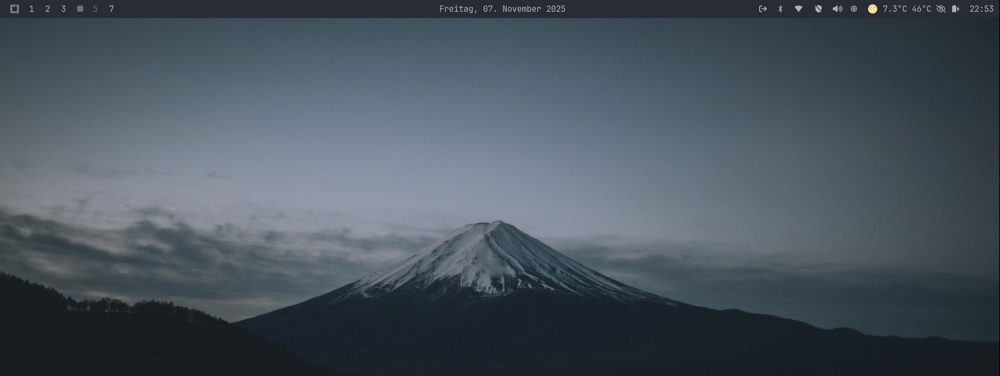
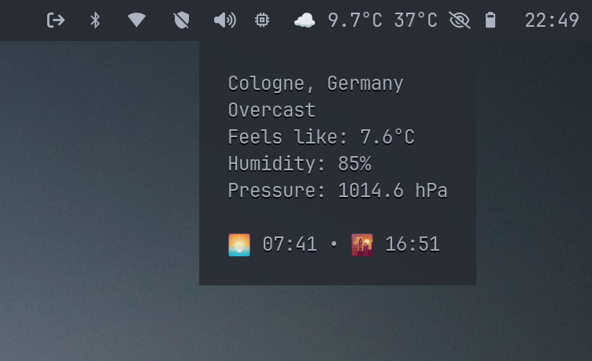

<!--
SPDX-FileCopyrightText: Winni Neessen <wn@neessen.dev>

SPDX-License-Identifier: MIT
-->

# waybar-weather
### A simple and elegant Waybar module to display weather data from Open-Meteo.

## About
waybar-weather is a simple programm written in Go that fetches weather data from Open-Meteo
and presents it in a format suitable to be used as custom Waybar module. It uses the Geoclue 
to determine your current location and fetches weather data for that location. 

## Features
* Uses different geolocation providers to find your current location.
  * Geolocation file
  * [GeoIP lookup](https://reallyfreegeoip.org)
  * [ICHNAEA/Mozilla Location Service (MLS)](https://ichnaea.readthedocs.io/en/latest/index.html) using WiFi BSSIDs around you
* Fetch weather data from Open-Meteo (free, no API key required).
* Integrates with Waybar as a custom module.
* Display current weather conditions and temperature.
* [Fully customizable.](#templating)
* Configurable via TOML, JSON or YAML.
* Lightweight, written in Go (single binary).

## Screenshots



## Requirements
* A working Linux installation with Waybar.
* Network connectivity for API calls
* (Optional) Ideally an active WiFi connectivity for ICHNAEA geolocation lookup (more precise location)

## Installation

### Using Pre-Built Binary
Pre-Built binaries are automatically built whenever a new release is created. Each release
holds binaries for several different Linux distributions. A checksum of each file is created
and stored in a combined checksums file. This checksums file is digitally signed via GPG. 
After downloading the corresponding file, make sure to also download the checksums file and its
corresponding signature file and verify that the checksums and signatures match.
The public GPG key is: ["Winni Neessen" (Software signing key) <wn@neessen.dev>](https://keys.openpgp.org/vks/v1/by-fingerprint/10B5700F5ECCB06532CEC873C3D38948DA536E89)

### From Source
To build from source, you require a working Go environment. Go 1.25+ is required.
Run the following commands to build the binary:
```bash
git clone https://github.com/wneessen/waybar-weather.git
cd waybar-weather
go mod tidy
go mod download
go mod verify
go build -o waybar-weather app
```

## Configuration

### waybar-weather
waybar-weather comes with defaults that should work out of the box for most users. You can however
provide a customer configuration file by appending the `-config` flag, followed by the path to your
configuration file. An example configuration file can be found in the [etc](etc) directory.

### Waybar integration
waybar-weather integrates with Waybar effortlessly. 

Add the following to your waybar config file (usually `.config/waybar/config.jsonc`):
```json
"custom/weather": {
    "exec": "<path_to_your>/waybar-weather",
    "restart-interval": 60,
    "return-type": "json",
    "hide-empty-text": true
}
```

Once you added that, add the module to your waybar module of choice, similar to this:
```json
"modules-right": [
    "cpu",
    "custom/weather",
    "battery",
    "clock"
],
```

waybar-weather always emits a custom CSS class to waybar, so you can apply your custom style to it. The class is
always `waybar-weather`. Add the following to your waybar config file (usually `.config/waybar/style.css`) to adjust
the style:
```css
.waybar-weather {
    <your_style_rules>
}
```

Once complete, restart Waybar and you should be good to go:
```bash
killall waybar && waybar
```

## Geo location lookup
waybar-weather tries to automatically determine your location using its built-in geolocation lookup
service (geobus). The geobus is a simple sub-pub service that utilizes different geolocation providers
to find your location. The most accurate result will be taken for looking up the weather data. You can
disable every geobus provider in your config file. By default all providers are enabled, to provide the
best possible location lookup.

### Geolocation file
A geolocation file is a simple static file in the format `<latitude>,<logitude>` that you can place
in you local home directory at `~/.config/waybar-weather/geolocation`. If the provider is enabled and
the file is present, waybar-weather will consider the coordinates in this file as best possible result.

### GeoIP lookup
The GeoIP lookup provider uses  [https://reallyfreegeoip.org](https://reallyfreegeoip.org) to look up
your IP and the resulting location based of that IP address. Depending on your ISP, the result might 
be very inaccurate

### ICHNAEA
The ICHNAEA location provider uses the Mozilla Location Service protocol to look up your location at
[beaconDB](https://beacondb.net/). To get your location it will look for WiFi interfaces on your computer
and scan for local networks in the area. The hardware addresses of these networks will then be transmitted
to beaconDB. The more WiFi networks waybar-weather is able to identify, the more accurate the results will
be. For most users, this will be the most accurate location source.

## Templating
waybar-weather comes with a templating engine that allows you to customize the output of the module.
The templating engine is based on [Go's text/template system](https://pkg.go.dev/text/template). You can
set your own template in the configuration file in the `templates` section. There is a setting for 
`text` and for `tooltip`. The `text` setting is used to display the weather data in the module. The
`tooltip` setting is used to display the weather data in the tooltip when hovering over the module.

### Variables
The following variables are available for use in the templates:

| Variable                   | Type        | Description                                         |
|----------------------------|-------------|-----------------------------------------------------|
| `{{.Latitude}}`            | `float64`   | The latitude of your current location.              |
| `{{.Longitude}}`           | `float64`   | The longitude of your current location.             |
| `{{.Elevation}}`           | `float64`   | The elevation of your current location.             |
| `{{.Address.DisplayName}}` | `string`    | The the full display name of your current location. |
| `{{.Address.Road}}`        | `string`    | The road name of your current location.             |
| `{{.Address.Suburb}}`      | `string`    | The suburb name of your current location.           |
| `{{.Address.City}}`        | `string`    | The city name of your current location.             |
| `{{.Address.County}}`      | `string`    | The county name of your current location.           |
| `{{.Address.State}}`       | `string`    | The state name of your current location.            |
| `{{.Address.Postcode}}`    | `string`    | The postcode of your current location.              |
| `{{.Address.Country}}`     | `string`    | The country name of your current location.          |
| `{{.Address.CountryCode}}` | `string`    | The country code of your current location.          |
| `{{.UpdateTime}}`          | `time.Time` | The last time the weather data was updated.         |
| `{{.WeatherDateForTime}}`  | `time.Time` | The date for the current/forecasted weather data.   |
| `{{.Temperature}}`         | `float64`   | The current temperature.                            |
| `{{.WeatherCode}}`         | `float64`   | The current weather code.                           |
| `{{.WindDirection}}`       | `float64`   | The current wind direction.                         |
| `{{.WindSpeed}}`           | `float64`   | The current wind speed.                             |
| `{{.IsDaytime}}`           | `bool`      | Is true if it is currently daytime.                 |
| `{{.TempUnit}}`            | `string`    | The temperature unit.                               |
| `{{.SunsetTime}}`          | `time.Time` | The time of sunset.                                 |
| `{{.SunriseTime}}`         | `time.Time` | The time of sunrise.                                |
| `{{.ConditionIcon}}`       | `string`    | The current weather condition icon.                 |
| `{{.Condition}}`           | `string`    | The current weather condition.                      |
| `{{.Moonphase}}`           | `string`    | The current moon phase.                             |
| `{{.MoonphaseIcon}}`       | `string`    | The current moon phase icon.                        |

## Formatting functions
waybar-weather comes with a set of formatting functions that can be used to manipulate the output of
specific variable types.

### time.Time formatting
waybar-weather comes with the `timeFormat` function as part of its templating system. It allows to
change the default formatting of a `time.Time` value to your liking. It follows the Go [time format
specifiers](https://pkg.go.dev/time#pkg-constants).

For example the following template value `{{timeFormat .UpdateTime "15:04"}}` will display the time
of the last update in the format `HH:MM`.

### float64 formatting
waybar-weather comes with the `floatFormat` function as part of its templating system. It allows to
output a float64 value with a custom precision. 

For example the following template value `{{floatFormat .Temperature 1}}` will display the current
temperature with a precision of 1 decimal place (e.g. `23.1` instead of `23.10`).

## Conditional formatting
Since waybar-weather uses the Go templating system, you can use the `if` and `else` statements to
display a value based on a boolean value. Let's assume you want to display a different icon for
daytime and nighttime. You can do so using the following template: 
`{{if .IsDaytime}}{{.ConditionIcon}}{{else}}{{.MoonphaseIcon}}{{end}}` (even though this example doesn't make 
much sense, it's just an example)


## License

This project is developed by Winni Neessen and released under the [MIT License](LICENSE).
